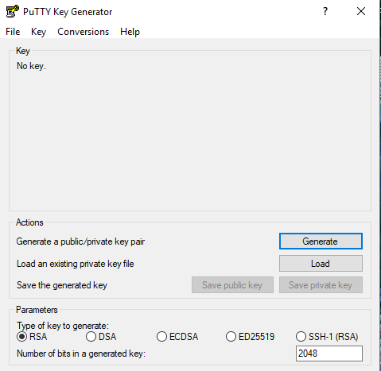
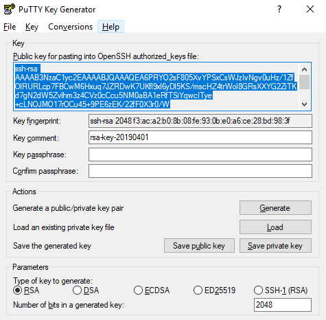
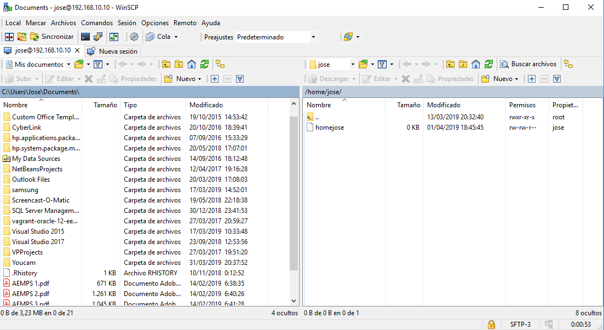

# SSH clave pública y privada

SSH (o Secure SHell) es el nombre de un protocolo y del programa que lo implementa cuya principal función es el acceso 
remoto a un servidor por medio de un canal seguro en el que toda la información está cifrada. Además de la conexión a 
otros dispositivos, SSH permite copiar datos de forma segura (tanto archivos sueltos como simular sesiones FTP cifradas),
gestionar claves RSA para no escribir contraseñas al conectar a los dispositivos y pasar los datos de cualquier otra 
aplicación por un canal seguro tunelizado mediante SSH y también puede redirigir el tráfico del (Sistema de Ventanas X) 
para poder ejecutar programas gráficos remotamente. El protocolo TCP asignado es el 22. [Ver más información, Wikipedia.](https://es.wikipedia.org/wiki/Secure_Shell)

Si configuramos este protocolo de conexión utilizando clave pública y privada, la autenticación de SSH tendrá un "plus" 
en lo que se refiere a la seguridad del servidor. El uso de estas claves en SSH implica un cifrado [criptográfico asimétrico](https://es.wikipedia.org/wiki/Criptograf%C3%ADa_asim%C3%A9trica)
que una simple password no es capaz de ofrecer. Además de esto, hace posible que los usuarios puedan realizar conexiones
al servidro sin necesidad de recordar contraseñas largas.

## Windows

En esta práctica vamos a utilizar como servidor Ubuntu Server y como cliente Windows 10 Pro y para comenzar descargaremos 
[putty](https://www.ssh.com/ssh/putty/download#sec-Download-PuTTY-installation-package-for-Windows) ,cliente SSH entre 
otros con licencia libre actualmente disponible en varias plataformas Unix. [Más información PuTTY.](https://www.google.com/search?q=putty&oq=putty++&aqs=chrome..69i57j0j35i39l2j0l2.3415j1j8&sourceid=chrome&ie=UTF-8)

### Generar las claves

Primeramente generaremos las claves pulsando el botón generate. Guardaremos en un notepadd la clave pública y la privada 
en una ubicación de tu ordenador.

Generadas y guardadas la claves [descargaremos winSCP](https://winscp.net/eng/download.php) que es una aplicación de 
software libre que funciona como cliente SFTP gráfico para Windows y que emplea SSH. [Ver más información.](https://es.wikipedia.org/wiki/WinSCP)

Instalado el programa habrá que introducir la IP del servidor y su correspondiente contraseña para que estén conectados
ambos equipos. Hecho esto podremos visualizar los paneles de ambos como se puede apreciar en la imagen superior. 
Ayudándonos de winSCP crearemos en nuestro directorio de usuario del panel del servidor el directorio ***`.ssh/AuthorizedKeys`*** 
en el que copiaremos el archivo guardado anteriormente de la clave pública. No hay que olvidarse de acceder en el equipo
servidor al archivo sshd_config mediante el comando ***`sudo nano sshd_config`*** para descomentar la línea 
***#Authorizedkeysfile...*** .
